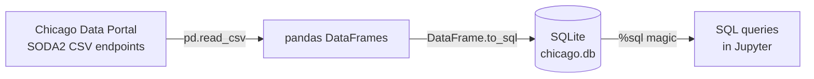
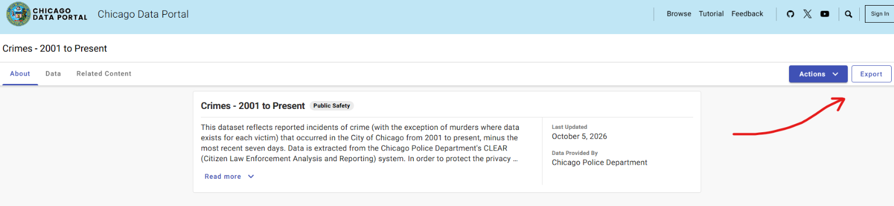
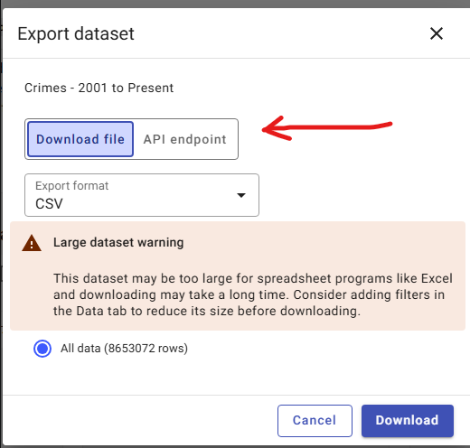
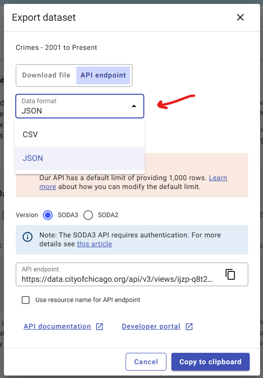
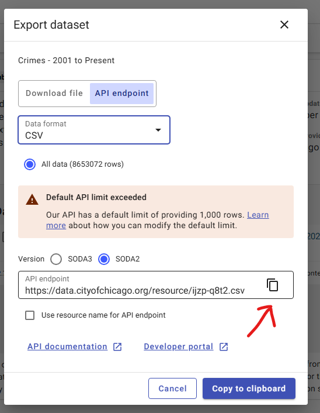

# chicago-sqlite-pandas-python
In this project, a database is created using SQLite3 in Python and populated with different datasets from the "Chicago Data Portal". The datasets include "Crimes - 2001 to Present," "Census Data," and "Chicago Public Schools." Finally, SQL queries are used to explore, navigate, and analyze the data stored in the database.

## Chicago Open Data → SQLite with pandas & JupySQL


[](https://colab.research.google.com/github/LuisRubenCarbajal/chicago-sqlite-pandas-python/blob/main/chicago_sqlite_pandas_us.ipynb)

Build a small relational database in Python from three public City of Chicago datasets, then explore it with plain SQL inside a Jupyter notebook.

> 🇪🇸 **¿Prefieres español?** Hay una versión completa en [`chicago_sqlite_pandas_es.ipynb`](chicago_sqlite_pandas_es.ipynb).

---

## Table of contents

- [Overview](#overview)
- [What you will learn](#what-you-will-learn)
- [Tools](#tools)
- [Data sources](#data-sources)
- [Quick start](#quick-start)
- [How to get the CSV API endpoint](#how-to-get-the-csv-api-endpoint)
- [What the notebook covers](#what-the-notebook-covers)
- [Notes and limitations](#notes-and-limitations)
- [Project structure](#project-structure)
- [Data attribution and license](#data-attribution-and-license)

---

## Overview

The notebook downloads three datasets from the [Chicago Data Portal](https://data.cityofchicago.org/) as CSV files, loads them into a local SQLite database (`chicago.db`) using pandas, and queries that database with the `%sql` magic from JupySQL.



## What you will learn

- Download CSV data straight from an open-data API with **pandas**.
- Store DataFrames as tables in a local **SQLite** database.
- Run SQL queries inside Jupyter using the **`%sql`** magic (JupySQL).
- Inspect table schemas and filter, sort and limit results with SQL.

## Tools

| Tool | Role in this project |
|---|---|
| **SQLite** (`sqlite3`) | File-based SQL database engine, no server needed |
| **pandas** | Reads the CSV data and writes it to SQLite with `DataFrame.to_sql()` |
| **JupySQL** (`%sql`) | Runs SQL queries directly in notebook cells |
| **prettytable** | Renders query results as readable tables |

## Data sources

| Table | Dataset | Category | ID | Rows loaded |
|---|---|---|---|---|
| `chicago_crimes` | [Crimes – 2001 to Present](https://data.cityofchicago.org/Public-Safety/Crimes-2001-to-Present/ijzp-q8t2/about_data) | Public Safety | `ijzp-q8t2` | 1,000 (sample) |
| `chicago_schools` | [Chicago Public Schools – Progress Report Cards](https://data.cityofchicago.org/Education/Chicago-Public-Schools-Progress-Report-Cards-2011-/9xs2-f89t/about_data) | Education | `9xs2-f89t` | 566 |
| `chicago_census` | [Census Data – Selected socioeconomic indicators](https://data.cityofchicago.org/Health-Human-Services/Census-Data-Selected-socioeconomic-indicators-in-C/kn9c-c2s2/about_data) | Health & Human Services | `kn9c-c2s2` | 78 |

The crimes dataset contains roughly **8.65 million rows** (as of 2026-10-06), so the notebook loads only a sample of 1,000 records.

## Quick start

**1. Clone the repository**

```bash
git clone https://github.com/LuisRubenCarbajal/chicago-sqlite-pandas-python.git
cd YOUR_REPO
```

**2. Create a virtual environment and install the dependencies**

```bash
python -m venv .venv

# macOS / Linux
source .venv/bin/activate
# Windows (PowerShell)
.venv\Scripts\Activate.ps1

pip install -r requirements.txt
```

**3. Launch Jupyter and open the notebook**

```bash
jupyter notebook chicago_sqlite_pandas_us.ipynb
```

Run all cells in order (**Kernel → Restart & Run All**). The notebook creates `chicago.db` in the working folder. An internet connection is required to download the data.

> **Running on Google Colab?** Uncomment the `%pip install` line for `jupysql` at the top of the notebook before running it.

> The notebook was developed with Python 3.14.3.

## How to get the CSV API endpoint

The notebook reads each dataset from a URL ending in `.csv`. Here is how to find that URL for any dataset on the portal:

**1. Open the dataset page and click _Export_.**



**2. In the dialog, switch from _Download file_ to _API endpoint_.**



**3. Set the data format to _CSV_.**



**4. Choose version _SODA2_ and copy the endpoint URL.** SODA3 requires authentication, so SODA2 is the simpler option for this project.



The URL looks like `https://data.cityofchicago.org/resource/ijzp-q8t2.csv`. By default the API returns **1,000 rows**; add `?$limit=N` to change that, for example `...ijzp-q8t2.csv?$limit=5000`.

> You can also download the CSV file and pass its local path to `pd.read_csv()` instead of the URL.

## What the notebook covers

| # | Query | SQL concepts |
|---|---|---|
| 1 | Column names and data types of `chicago_crimes` | `PRAGMA table_info` |
| 2 | Total number of crimes in the table | `COUNT(*)` |
| 3 | Crime descriptions containing the keywords `child` or `minor` | `LIKE`, `OR` |
| 4 | Crimes whose location mentions a school | `LIKE` |
| 5 | Column names and data types of `chicago_schools` | `PRAGMA table_info` |
| 6 | Column names and data types of `chicago_census` | `PRAGMA table_info` |
| 7 | Five community areas with the highest share of households below the poverty line | `ORDER BY`, `DESC`, `LIMIT` |

**Example – query 7:**

```sql
SELECT Community_area_name, PERCENT_HOUSEHOLDS_BELOW_POVERTY
FROM chicago_census
ORDER BY PERCENT_HOUSEHOLDS_BELOW_POVERTY DESC
LIMIT 5;
```

| Community area | % households below poverty |
|---|---|
| Riverdale | 56.5 |
| Fuller Park | 51.2 |
| Englewood | 46.6 |
| North Lawndale | 43.1 |
| East Garfield Park | 42.4 |

The notebook ends by closing the SQLite connection with `conn.close()`.

## Notes and limitations

- **The crimes table is a sample.** Only 1,000 records are loaded and no sort order is specified, so results are for demonstration and are not statistically representative.
- **Keyword searches are approximate.** `LIKE '%minor%'` also matches phrases such as "minor injury", so it is a text search, not a precise filter for crimes involving minors.
- **Data changes over time.** The portal updates its datasets regularly, so the numbers you get may differ from those shown here. The crimes dataset excludes the most recent seven days.
- **Tables are recreated on every run.** The notebook uses `if_exists='replace'`, so re-running it overwrites the existing tables in `chicago.db`.
- **Install only `jupysql`.** `ipython-sql` is the older project JupySQL was forked from, and having both installed can cause conflicts with `%load_ext sql`.

## Project structure

```
.
├── chicago_sqlite_pandas_us.ipynb   # Notebook (English)
├── chicago_sqlite_pandas_es.ipynb   # Notebook (Spanish)
├── images/                          # Screenshots used in this README
├── requirements.txt                 # Python dependencies
├── README.md
├── LICENSE
└── .gitignore                       # Excludes the generated chicago.db
```

## Data attribution and license

- Data: [City of Chicago Data Portal](https://data.cityofchicago.org/). The crimes dataset is provided by the Chicago Police Department. Please review the terms of use shown on each dataset's page before reusing the data.
- Disclaimer: “This site provides applications using data that has been modified for use from its original source, www.cityofchicago.org, the official website of the City of Chicago.  The City of Chicago makes no claims as to the content, accuracy, timeliness, or completeness of any of the data provided at this site.  The data provided at this site is subject to change at any time.  It is understood that the data provided at this site is being used at one’s own risk.” 


---

If you find this project useful, consider giving it a ⭐.
